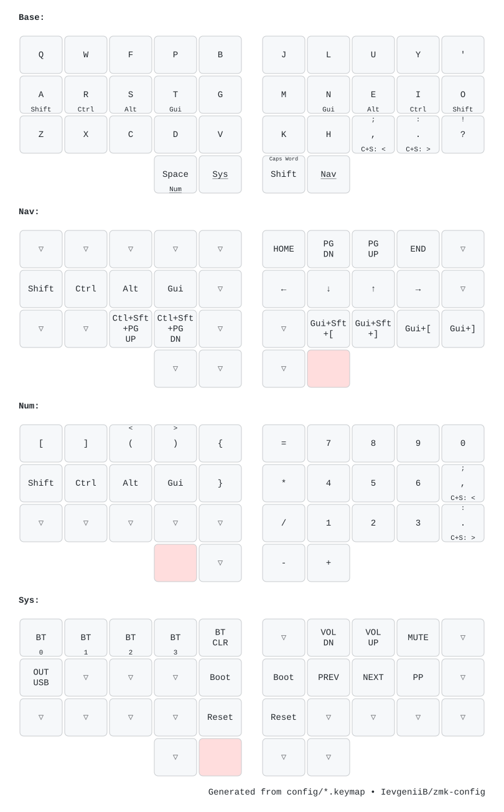

# ZMK configuration: Glove80 and Urchin

A shared 34-key Colemak-DH-style layout with home-row modifiers, punctuation
morphs and 29 combos. The Glove80 adapter adds its outer keys and a Magic layer;
the Urchin adapter uses the shared 34 positions directly. Firmware behavior is
configured in `config/`, never in the generated diagrams.

| Target | Configuration |
| --- | --- |
| `glove80_lh` | USB ZMK Studio snippet and `CONFIG_ZMK_STUDIO=y` |
| `glove80_rh` | Glove80 peripheral |
| `nice_nano_v2` + `urchin_left nice_view_adapter nice_view` | Urchin central + display |
| `nice_nano_v2` + `urchin_right nice_view_adapter nice_view` | Urchin peripheral + display |
| `nice_nano_v2` + `settings_reset` | Dedicated settings-reset image; not a typing layout |

## Generated keymaps

[Glove80 layers](draw/glove80.svg) · [Glove80 combos](draw/glove80-combos.svg) ·
[Urchin layers](draw/urchin.svg) · [Urchin combos](draw/urchin-combos.svg)



Glove80 uses the physical geometry shipped by the pinned MoErgo firmware.
Urchin uses a **matrix-order schematic** with the correct 34 positions, not a
measurement of its physical column stagger. Both diagrams parse the actual
board adapter, including its helper macros and extra keys. Combo diagrams
retain the source layer restrictions; no combos are moved to a fictional layer.
The adjacent YAML files are generated, reviewable data.

On a key, the center is the tap action, the bottom is the hold action and the
top is the shifted action. `▽` means transparent; an empty key is disabled.
On combo cards, the bottom legend lists the active layers.
Special key legends labeled `C+S:` (Ctrl+Shift) or `2x:` describe modifier or
tap-dance actions, not holds. `Gui` is the platform GUI modifier (Command on macOS).
`smart_shft` becomes Caps Word when **left Shift** is already held. BLE profile
numbers are zero-based; Magic-layer BLE keys select BLE output/profile on one
tap and disconnect that profile on two taps. RGB status is a tap on the Magic
hold-tap; holding enters the Magic layer. Timing and nested behavior details
remain authoritative in `config/base.keymap` and `config/combos.dtsi`.

ZMK Studio can change a keyboard's runtime layout. These images describe the
repository firmware, not any later Studio edits stored on hardware.

## Reproduce and validate

Use Python 3.12. Diagram dependencies are pinned, including transitive packages:

```sh
python3.12 -m venv .venv-draw
. .venv-draw/bin/activate
python -m pip install -r scripts/draw-requirements.txt
python scripts/draw-keymaps.py --workspace /path/to/west-workspace
python scripts/draw-keymaps.py --workspace /path/to/west-workspace --check
```

Drawing needs only the pinned `zmk` and `zmk-helpers` checkouts, named as above
inside the workspace; it does not download geometry or depend on QMK's current
layouts. The `Keymap diagrams` workflow obtains those exact refs from
`config/west.yml` and fails when committed SVG/YAML output is stale. Edit source
keymaps or `draw/config.yaml`, regenerate, and commit the resulting files together.

For a new firmware workspace, install west and the prerequisites in the
[ZMK local-build guide](https://zmk.dev/docs/development/local-toolchain/setup/native),
then initialize **from this configuration**, so its manifest controls dependencies:

```sh
mkdir -p /path/to/west-workspace/config
cp /absolute/path/to/zmk-config/config/west.yml /path/to/west-workspace/config/west.yml
west init -l /path/to/west-workspace/config
cd /path/to/west-workspace
west update
west zephyr-export
python -m pip install -r zephyr/scripts/requirements.txt
```

The audited local toolchain is Zephyr SDK **0.16.8**, west **1.5.0**, CMake
**3.31.6**, Ninja **1.13.2**, Python **3.12**. Activate that toolchain, then:

```sh
python /absolute/path/to/zmk-config/scripts/build-all.py \
  --workspace /path/to/west-workspace --output /path/to/zmk-config/build
# Also put the diagram environment's keymap command on PATH for this check:
python /absolute/path/to/zmk-config/scripts/validate-keymaps.py \
  --workspace /path/to/west-workspace --build-root /path/to/zmk-config/build
```

The builder makes a pristine build for every `build.yaml` entry, continues after
individual failures, and returns failure if any target fails or lacks a UF2.
`build/results.json` records commands, outcomes, artifact paths and SHA-256 hashes;
per-target logs stay beside it. The diagram validator compares **every behavior
name and numeric argument** in every layer, plus every combo's output, positions
and layer scope, against the four compiled keyboard devicetrees. The reset target
has no user keymap and is built separately.

On the published workspace, source `/workspace/.zmk-tools/activate.sh` and use
`--workspace /workspace/.zmk-tools/firmware`. Its manifest lives in a separate
`firmware/config` checkout: copy the current `config/west.yml` there and run
`west update` after dependency changes. Always pass this repository's keymap
configuration via the supplied build runner.

## Maintenance

See [the baseline audit and maintenance scope](docs/maintenance.md). Firmware,
helpers, Zephyr and the reusable build workflow now use exact commits. This
pins sources, not the whole cloud execution environment: the MoErgo workflow
still references mutable action tags and a `stable` container image. Local and
cloud builds are therefore not claimed to be bit-for-bit identical.

Keep dependency updates and behavioral experiments in separate draft PRs.
MoErgo compatibility must be retained for Glove80. Do not copy another person's
layout wholesale; verify a proposed behavior against this layout and describe
its tradeoffs before hardware testing. The first maintenance change does not
alter any key binding, combo, timing, or board configuration.

Authorized releases use `firmware-*` tags after a validated merge; see the
[publishing procedure](docs/maintenance.md#publishing-an-authorized-firmware-release).
